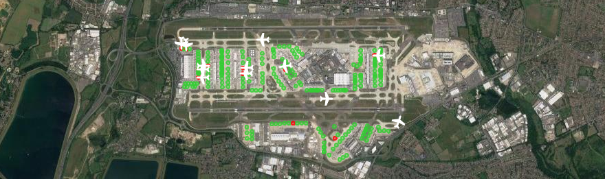

# VATSIM Stand Status 



## Table of Contents

* [About](#about)
* [Installation](#installation)
* [Configuration](#configuration)
* [Usage](#usage)
    + [Construct an Instance](#construct-an-instance)
    + [Loading Stand Data](#loading-stand-data)
    + [Parsing the Data](#parsing-the-data)
* [Data Types](#data-types)
* [Examples](#examples)
    * [Constructing the library with a CSV data file](#constructing-the-library-with-a-csv-data-file)
    * [Constructing the library with a stand data array](#constructing-the-library-with-a-stand-data-array)
    * [Getting all the stands](#getting-stands)
    * [Getting all occupied stands](#getting-all-occupied-stands)
    * [Get all aircraft on the ground](#get-all-aircraft-on-the-ground)


## About

###### Description
vatsim-stand-status is a lightweight PHP library to allow the correlation between aircraft on the VATSIM flight simulation network, and an airport stand.

VATSIM network data is downloaded and parsed by [Skymeyer's Vatsimphp](https://github.com/skymeyer/Vatsimphp) library.


###### Requirements
* PHP 7.2 and above

###### Author
This package was created by [Alex Toff](https://alextoff.uk)

###### License
`vatsim-stand-status` is licensed under the GNU General Public License v3.0, which can be found in the root of the package in the `LICENSE` file.


## Installation

The easiest way to install stand status is through the use of composer:
```
$ composer require cobaltgrid/vatsim-stand-status
```

> New to Composer? [Here is a useful guide on getting started](https://www.codementor.io/@jadjoubran/php-tutorial-getting-started-with-composer-8sbn6fb6t)


## Configuration

Stand Status's options are easily configurable through a series of setters on the base class. After changing the settings, make sure to run `$standStatus->parseData()` to (re)run the correlation algorithm.

Note that these are fluent setters, so you can chain them together.

Below are the available options. Prefix with get/set depending on what you want to change:

* **maxStandDistance**
    * This is the maximum an aircraft can be from a stand (in km) for that stand to be considered in the search for matching aircraft with stand
    * Default: `0.07` km

* **hideStandSidesWhenOccupied**
    * If true, stand sides (such as 42L and 42R) will be hidden when an aircraft occupies the 'base' stand, or a side. e.g. if an aircraft is occupying stand 42, the stands 42L and 42R will be removed from the list of stands
    * Default: `true`
    
* **maxDistanceFromAirport**
    * Aircraft filter. Aircraft that are within this distance from the defined center of the airport will be eligible for stand assignment.
    * Default: `2` km
    
* **maxAircraftAltitude**
    * Aircraft filter. Aircraft below this altitude will be eligible for stand assignment.
    * Default: `3000` ft
    
* **maxAircraftGroundspeed**
    * Aircraft filter. Aircraft below this ground speed will be eligible for stand assignment.
    * Default: `10` kts
    
* **standExtensions**
    * An array that defines the characters to indicate side stands.
    * Default: `['L', 'C', 'R', 'A', 'B', 'N', 'E', 'S', 'W']`
    
* **standExtensionPattern**
    * A string that describes the pattern for stand names. **MUST** contain `<standroot>` and `<extensions>`. Default will work for any stand following the format 42L, 42R, 155, etc.
    * Default: `'<standroot><extensions>'`

#### Example
```php
    // Sets the maximum allowed altitude to 4000ft, and searches aircraft within 5km of defined centre
    $standStatus->setMaxAircraftAltitude(4000)->setMaxStandDistance(5)->parseData();
```

## Usage

There are 3 steps you need to take in order to get this library working:

### Construct an Instance

If you have installed via composer, include the autoloader:
```
     require('./vendor/autoload.php');
     use CobaltGrid\VatsimStandStatus\StandStatus;
```


Then, an instance of the class must be made:
```
$StandStatus = new StandStatus(
        $airportLatitude,
        $airportLongitude,
        $standCoordinateFormat = self::COORD_FORMAT_DECIMAL
);
```

##### Required
* `$airportLatitude` - The decimal-format version of the airport's latitude. e.g. 51.148056
* `$airportLongitude` - The decimal-format version of the airport's longitude. e.g. -0.190278
##### Optional
* `$standCoordinateFormat` - Sets the format of coordinates in the stand data file. Defaults to decimal.
    * Use `StandStatus::COORD_FORMAT_DECIMAL` for decimal coordinates (-51.26012)
    * Use `StandStatus::COORD_FORMAT_CAA` for CAA / Aerospace Coordinate format (510917.35N)

Here is an example:
```php
    use CobaltGrid\VatsimStandStatus\StandStatus;

    $StandStatus = new StandStatus(
        51.148056,
        -0.190278,
        StandStatus::COORD_FORMAT_CAA
    );
```

### Loading Stand Data

After constructing the instance, you must load in the stand data for the airport.

Stand status accepts two types of stand data input:

####1. CSV Data File

Stand data can be read into the library via a CSV file, an example of which can be found in the `tests/Fixtures/SampleData/egkkstands.csv`.

You can load in a CSV file's data like so:
```php
    $standStatus->loadStandDataFromCSV('path/to/data.csv');
```

The first row is reserved for headers. The order of which should be ID, Latitude and Longitude.

* In the ID column is the stand name. This can be text, such as "42L", and doesn't just have to be a number.
* In the Latitude and Longitude columns should be the stand's latitude and longitude coordinate respectively. Current supported formats are:
    * Decimal (Default) - e.g. 51.0100 by -1.12000
    * CAA / Aerospace - e.g. 510917.35N

If your stand data file uses anything other than the default, you must specify this when constructing the instance (See above section)

In the end, you should have a CSV file that looks something like this (For a CAA / Aerospace format):

| id        	| latitude      | longitude  	|
| ------------- |:-------------:| :----:	|
| 1 		| 510917.35N 	| 0000953.33W 	|
| 2 		| 510915.83N    | 0000952.81W 	|
| 3		| 510914.31N    | 0000952.28W 	|	

####2. Array

Alternatively, you can load in stand data through an array that follows the format id, latitude, longitude:
```php
    $standStatus->loadStandDataFromArray([
        ['1', '510917.35N', '0000953.33W'],
        ['2', '510915.83N', '0000952.81W'],
        ['3', '510914.31N', '0000952.28W'],
        ...
    ]);
```

Again, make sure you set the correct stand coordinate format in the constructor.

### Parsing the Data

You must then tell the library to download and parse the VATSIM data to assign aircraft to stands. This is done like so:
```php
    $standStatus->parseData();
```

You can then use the methods to retrieve a list of stands with assigned aircraft, etc.

## Data Types

There are two main object types used:
* `Stand::class`
    * Can call the stand's ID, latitude and longitude via properties (e.g. `$stand->latitude`)
    * `$stand->occupier` Returns the occupier (a `Aircraft::class` object), or null if none
    * `$stand->isOccupied()` Returns a boolean value for if the stand is occupied or not
    * `$stand->getRoot()` Gets the root of the stand. e.g. Stand 42R's root is 42
    * `$stand->getExtension()` Gets the extension for the stand, if it has one. e.g. Stand 42R's extension is 'R'

* `Aircraft::class`
   * The following properties are available on the instance (e.g. `$aircraft->callsign`)
   >callsign,cid,realname,clienttype,frequency,latitude,longitude,altitude,groundspeed,planned_aircraft,planned_tascruise,planned_depairport,planned_altitude,planned_destairport,server,protrevision,rating,transponder,facilitytype,visualrange,planned_revision,planned_flighttype,planned_deptime,planned_actdeptime,planned_hrsenroute,planned_minenroute,planned_hrsfuel,planned_minfuel,planned_altairport,planned_remarks,planned_route,planned_depairport_lat,planned_depairport_lon,planned_destairport_lat,planned_destairport_lon,atis_message,time_last_atis_received,time_logon,heading,QNH_iHg,QNH_Mb
    * `$aircraft->onStand()` Returns a boolean value for if the aircraft is on a stand

## Examples

For an integrated usage example, see the Gatwick demo in `examples/eggkStands.php`.

##### Constructing the library with a CSV data file
```php
    use CobaltGrid\VatsimStandStatus\StandStatus;
    $standStatus = new StandStatus(
        51.148056,
        -0.190278,
        StandStatus::COORD_FORMAT_CAA);
    $standStatus->loadStandDataFromCSV('path/to/data.csv')->parseData();
```

##### Constructing the library with a stand data array
```php
    $standStatus = new \CobaltGrid\VatsimStandStatus\StandStatus(
        51.148056,
        -0.190278);
    $standStatus->loadStandDataFromArray([
        ['1', 51.154819, -0.164813],
        ['10', 51.15509, -0.16466],
        ['101', 51.1568, -0.17706]
    ])->parseData();
```

##### Getting stands
```php
    foreach ($standStatus->stands() as $stand){
        if ($stand->isOccupied()) {
            echo "Stand {$stand->getName()} is occupied by {$stand->occupier->callsign}</br>";
        }else{
             echo "Stand {$stand->getName()} is not occupied </br>";
        }	
    }

    // Output:
    // Stand 1 is occupied by SHT1G
    // Stand 2 is not occupied
```
> Note that the output of `allStands()` will hide "side stands" if the `hideStandSidesWhenOccupied` setting is true


##### Getting all occupied stands

```php
    foreach ($standStatus->occupiedStands() as $stand){
        echo "Stand {$stand->getName()} is occupied by {$stand->occupier->callsign}</br>";
    }

    // Output:
    // Stand 1 is occupied by SHT1G
    // Stand 3L is occupied by DLH49Y
```
> If you want an associative array, where the index is the stand name, use `->occupiedStands(true)`

>Similarly, you can also use `->unoccupiedStands()` to get an array of unoccupied stands
>
##### Get all aircraft on the ground

```php
    foreach ($standStatus->getAllAircraft() as $aircraft){
        if($aircraft->onStand()){
            $stand = $aircraft->getStand($standStatus->allStands());
            echo "{$aircraft->callsign} is on stand {$stand->getName()}</br>";
        }else{
            echo "{$aircraft->callsign} is not on stand</br>";
        }          
    }

    // Output:
    // BAW53M is not on stand
    // EZY48VY is on stand 554
```
> If you want an associative array, where the index is the stand name, use `->occupiedStands(true)`

